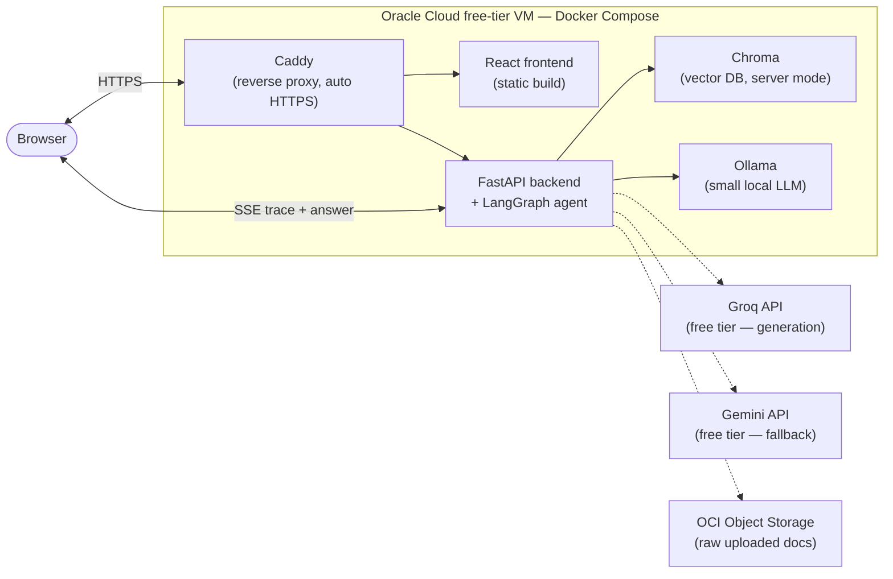

# CourseLens — Agentic RAG

CourseLens started as a single-user CLI tool for asking questions over a fixed set of course PDFs. It's being rebuilt into a hosted, multi-document, **agentic** RAG web app: any user uploads their own documents and gets grounded, cited answers — with the agent self-correcting when retrieval comes back weak, rather than confidently answering off irrelevant context.

## Why "agentic" instead of just RAG

Any LLM can already answer questions about an uploaded PDF. The parts a raw file-upload chat can't do are the actual point of this project:

1. **Grounded, per-chunk citations** the user can verify (source + page, not vibes).
2. **Self-correction** — the agent grades its own retrieved evidence and re-queries when retrieval is weak, instead of generating off bad context.
3. **Cross-document reasoning** — answering questions that need evidence pulled from multiple uploaded docs at once.
4. **A visible reasoning trace** — showing the retrieve → grade → (re-query) → generate steps as they happen, not just a final answer.

Every architecture decision below is chosen to serve one of these four; nothing is added for its own sake.

## Status

| Step | What | Status |
|---|---|---|
| 1 | Split the CLI into reusable modules; run Chroma as a server, not embedded; content-based document typing | ✅ Done |
| 2 | LangGraph corrective-RAG pipeline (standalone, not yet wired to a server) | 🚧 In progress |
| 3 | Wrap in FastAPI with an SSE trace endpoint + background-task ingestion | ⏳ Not started |
| 4 | React frontend (upload UI, chat UI, citations) | ⏳ Not started |
| 5 | Dockerize everything, deploy to an Oracle free-tier VM | ⏳ Not started |
| 6 | Tracing (Langfuse/LangSmith) + a small eval pass vs. naive RAG | ⏳ Not started |

Step 2 detail: `app/agent/state.py` (the shared state schema) and `app/agent/nodes.py::retrieve_node` are done. The remaining nodes (`rewrite_query_node`, `rerank_node`, `grade_documents_node`, `generate_answer_node`, `check_groundedness_node`) and the full graph wiring in `app/agent/graph.py` are being built out incrementally.

## System architecture

### Target deployment (step 5)



Today, only `chroma` runs in Docker (`docker-compose.yml`); `backend`/`frontend`/`ollama`/`caddy` are added in step 3–5. Ingestion and querying currently run as local CLI scripts (`ingest.py` / `query.py`) against that Chroma server.

### Agent pipeline (corrective RAG)

```mermaid
flowchart TD
    Q(["query"]) --> Rewrite["rewrite_query_node"]
    Rewrite --> Retrieve["retrieve_node ✅"]
    Retrieve --> Rerank["rerank_node"]
    Rerank --> Grade["grade_documents_node"]
    Grade -->|enough relevant chunks| Generate["generate_answer_node"]
    Grade -->|too few, retries left \n(capped ~2)| Rewrite
    Generate --> Ground["check_groundedness_node"]
    Ground -->|grounded| Done(["answer + citations"])
    Ground -->|not grounded, retry available| Generate
```

`rewrite_query_node` and `retrieve_node` use a small local Ollama model / no LLM respectively; `rerank_node` uses a local cross-encoder; `grade_documents_node` and `check_groundedness_node` use the small Ollama model; `generate_answer_node` uses Groq (primary) or Gemini (fallback) — see [Component decisions](#component-decisions) for why.

## Component decisions

| Concern | Choice | Why |
|---|---|---|
| Agent orchestration | **LangGraph**, the only agent framework in the stack | LlamaIndex also has an agent/workflow layer — running two overlapping frameworks is unneeded complexity. LlamaIndex stays scoped to loading/parsing/indexing/retrieval. |
| Cheap agent steps (rewrite, grade, groundedness) | **Ollama**, local, small model (`qwen2.5:3b` / `llama3.2:3b` class) | These are short classification/rewrite tasks, not long-form generation — a small model stays usable on CPU. |
| Final answer generation | **Groq** free tier, **Gemini** free tier as fallback | Groq's free tier is fast enough to be worth spending the "real" model budget on; Gemini covers rate-limit gaps. |
| Embeddings | Local `bge-small-en-v1.5` (sentence-transformers) | No API, cheap on CPU, keeps embedding fully free. |
| Reranking | Local cross-encoder (`bge-reranker-base`/`v2-m3`) | Vector similarity alone is a coarse filter; this is the concrete "better retrieval quality" mechanism. |
| Vector DB | **Chroma, server mode** (not embedded `PersistentClient`) | Ingestion (background task) and querying (API request) are separate concurrent processes — embedded mode risks file-lock contention. |
| Raw document storage | Docker volume for now; **OCI Object Storage** once deployed | Compute is already on Oracle — no cross-cloud egress, and OCI's free tier doesn't expire after 12 months the way S3's does. |
| Backend | **FastAPI** | SSE streaming of the agent's step-by-step trace (the visible-reasoning differentiator) + `BackgroundTasks` for ingestion, without needing Celery/Redis at this scale. |
| Frontend | **React (Vite)** | Consumes the SSE trace stream; renders citations as clickable references back to source chunks/pages. |
| Deployment | **Docker Compose** on an Oracle Ampere A1 Always-Free VM, **Caddy** for automatic HTTPS | Comfortably fits all four containers (frontend, backend, chroma, ollama); Caddy is simpler than hand-rolled nginx+certbot. |
| Multi-tenancy | Anonymous session-ID cookie scoping a Chroma collection per session, with TTL cleanup | $0/solo scale — a full auth system isn't worth building; this is enough to keep users' docs from leaking into each other. |

### Document typing (implemented in step 1)

Documents are **not** classified by filename. `app/chunking.py` classifies each uploaded file from its own content:
- Word-density per page distinguishes slide decks from dense prose.
- A fraction-of-pages exam-pattern check ("Question N", "(N marks)", "Answer all/any") identifies past-paper-style documents, calibrated at the *file* level (not per-page) to avoid both under-recall and stray false positives on large documents.
- An optional `type_overrides: dict[str, str]` (file name → type) lets a user pin a type on upload — auto-detection is always the default, never required.

## Known weaknesses / risks

Carried over from the architecture plan, worth keeping in mind as the build progresses:

1. **Latency stacks on CPU** across a multi-hop agent graph — correction loops are hard-capped (~2), and steps should get explicit timeouts with graceful fallback rather than hanging.
2. **Free API rate limits** (Groq/Gemini) are shared across all users, not per-user — needs a visible "rate limited, try again" path, not a silent failure.
3. **Unauthenticated public upload endpoint = abuse vector** — needs a strict file size cap, file-type allowlist, and upload rate limiting once the endpoint exists.
4. **PDF parsing attack surface** — validate MIME/type strictly, don't trust the extension, don't let one bad file crash ingestion for other sessions.
5. **Oracle "Always Free" reclamation risk** — not a hard uptime guarantee; fine for a portfolio demo, worth knowing before relying on it long-term.
6. **No eval harness yet** — the whole premise is "the agentic hops add value"; a small before/after comparison (naive RAG vs. the corrective graph) on a handful of test questions is planned for step 6 to actually confirm that, not just assume it.

## Repository layout

```
RAG/
├── app/
│   ├── config.py            # env-driven settings: API keys, Chroma host/port, data dir, model names
│   ├── embeddings.py         # local HuggingFace embedding model factory
│   ├── llm.py                 # Gemini LLM factory (used by the CLI query pipeline)
│   ├── vector_store.py         # Chroma HttpClient + LlamaIndex vector store / storage context
│   ├── loaders.py               # PDF loading (SimpleDirectoryReader + PyMuPDFReader)
│   ├── chunking.py               # content-based document type detection + per-type chunking strategies
│   ├── ingest_pipeline.py         # loaders + chunking + vector store, tied together for ingestion
│   ├── query_pipeline.py           # pre-agent CLI query pipeline (routing + retrieval + generation)
│   └── agent/                       # LangGraph corrective-RAG pipeline (step 2)
│       ├── state.py                  # GraphState — shared state schema for all nodes
│       ├── nodes.py                   # graph nodes (retrieve_node done; rest in progress)
│       └── graph.py                    # graph wiring
├── data/                       # raw source documents (gitignored)
├── chroma_db/                   # Chroma's persistent storage, bind-mounted into the chroma container
├── docker-compose.yml             # Chroma server today; more services added in step 5
├── requirements.txt
├── ingest.py                       # thin CLI entrypoint -> app.ingest_pipeline
├── query.py                         # thin CLI entrypoint -> app.query_pipeline
└── .env.example                      # documents required/optional env vars
```

## Getting started (current CLI + Chroma server)

1. **Install dependencies**
   ```
   python -m venv .venv
   .venv/Scripts/activate   # or source .venv/bin/activate on macOS/Linux
   pip install -r requirements.txt
   ```
2. **Configure environment** — copy `.env.example` to `.env` and set `GOOGLE_API_KEY` (Gemini). Override `CHROMA_PORT` etc. if the defaults collide with something else already running.
3. **Start Chroma**
   ```
   docker compose up -d chroma
   ```
4. **Ingest documents** — drop PDFs in `data/`, then:
   ```
   python ingest.py
   ```
5. **Ask a question**
   ```
   python query.py "What is Constructive Cost Model?"
   ```

### Agent pipeline (step 2, once complete)

Additionally requires a local Ollama instance with a small model pulled (e.g. `ollama pull llama3.2:3b`). Run the graph directly with:
```
python -m app.agent.graph
```

## Implementation plan

1. **Split `ingest.py`/`query.py` into reusable modules; run Chroma as a server; move raw storage to a Docker volume.** ✅ Done — see `app/` and `docker-compose.yml`.
2. **Build the LangGraph pipeline** (rewrite → retrieve → rerank → grade → generate → groundedness check) as a standalone script; wire in Ollama for the small steps and Groq/Gemini for generation. Validate it beats the current naive `query_pipeline.py` on a handful of manual test questions before moving on. 🚧 In progress.
3. **Wrap it in FastAPI** with an SSE endpoint streaming the trace; add `BackgroundTasks` ingestion with size/type-validated upload.
4. **Build the React frontend**: upload UI, chat UI consuming the SSE stream, citations rendered from chunk metadata.
5. **Dockerize all services**, add Caddy, deploy to the Oracle VM; add session TTL cleanup; move raw storage to OCI Object Storage.
6. **Add tracing** (Langfuse/LangSmith) and a small eval pass to confirm the agentic pipeline actually outperforms naive RAG.

### Verification at each step

- Step 2's pipeline should be checked against `query.py`'s current behavior on the same test queries, against the same `chroma_db` data, comparing answer quality/citation correctness before moving on.
- After step 3, exercise the FastAPI endpoints directly (curl/httpie or a script) for upload + query + SSE streaming before building the frontend against them.
- After step 4/5, manually run the full upload → ask → cited-answer flow in a browser against the Dockerized stack, including a deliberately irrelevant query, to confirm the "I cannot find the answer" / low-groundedness path actually works.
