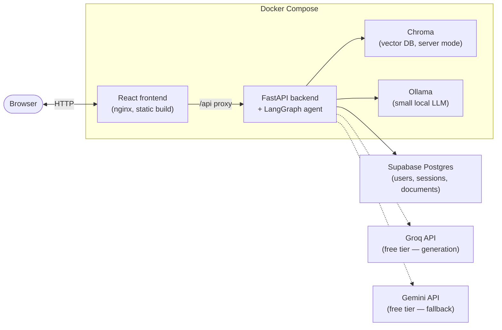

# NoteMate — Agentic RAG

NoteMate is a hosted, multi-document, **agentic** RAG web app: upload your own PDFs, get grounded, cited answers — with an agent that self-corrects when retrieval comes back weak, rather than confidently answering off irrelevant context.

## Why "agentic" instead of just RAG

Any LLM can already answer questions about an uploaded PDF. The parts a raw file-upload chat can't do are the actual point of this project:

1. **Grounded, per-chunk citations** the user can verify (source + page, not vibes).
2. **Self-correction** — the agent grades its own retrieved evidence and re-queries when retrieval is weak, instead of generating off bad context.
3. **Cross-document reasoning** — answering questions that need evidence pulled from multiple uploaded docs at once.
4. **A visible reasoning trace** — showing the retrieve → grade → (re-query) → generate steps as they happen, not just a final answer.

Every architecture decision below is chosen to serve one of these four; nothing is added for its own sake.

## Status

| Step | What | Status |
|---|---|---|
| 1 | Split the CLI into reusable modules; run Chroma as a server; content-based document typing | ✅ Done |
| 2 | LangGraph corrective-RAG pipeline | ✅ Done |
| 3 | FastAPI backend — auth, sessions, document upload/ingestion, chat (plain + SSE streaming) | ✅ Done |
| 4 | React frontend — signup/login, dashboard, session creation, chat UI | ✅ Done |
| 5 | Dockerize all four services (frontend, backend, Chroma, Ollama) | ✅ Done |
| 6 | Deploy to a cloud VM; tracing (Langfuse/LangSmith); a small eval pass vs. naive RAG | ⏳ Not started |

## What you need before you start

**Either** Docker + Docker Compose (the easy path — one command runs everything), **or**, for local/manual development: Python 3.13, Node.js 22+, and [Ollama](https://ollama.com) installed and running.

Regardless of path, you need two free-tier external accounts:

- **[Supabase](https://supabase.com)** — a free project for Postgres (auth/sessions/documents storage). After creating a project: Project Settings → Database → Connection string → URI.
- **[Google AI Studio](https://aistudio.google.com/apikey)** — a free Gemini API key (used for answer generation).

Optional:
- **[Groq](https://console.groq.com/keys)** — a free API key. If set, `generate_answer_node` uses Groq as the primary model and only falls back to Gemini on failure/rate limits.

## Getting started (Docker — recommended)

1. **Clone and configure**
   ```
   git clone https://github.com/SakinduR/notemate.git
   cd notemate
   cp .env.example .env
   ```
   Edit `.env`: set `GOOGLE_API_KEY`, `DATABASE_URL` (from Supabase), and generate a `JWT_SECRET`:
   ```
   python -c "import secrets; print(secrets.token_urlsafe(32))"
   ```
   Everything else in `.env.example` has a working default.

2. **Build and start everything**
   ```
   docker compose up --build
   ```
   This builds and starts all four services: `chroma`, `ollama` (auto-pulls its model on first run — a few minutes and a couple GB the very first time), `backend`, `frontend`. First boot is slow (model downloads for the backend's local embedding/reranker models too); subsequent starts are fast.

3. **Open the app** at `http://localhost:5173`, sign up, create a session, upload a PDF, and ask a question once ingestion finishes.

Default ports: frontend `5173`, backend `8090`, Chroma `8001`. If any collide with something already running on your machine, change the host-side port (the number before the `:`) in `docker-compose.yml`.

To stop everything: `docker compose down`. Your Postgres data lives in Supabase (not local), so it persists regardless; Chroma/Ollama data persist in local volumes/bind mounts between runs.

## Getting started (manual / local development)

Useful if you're actively developing rather than just running the app.

1. **Backend dependencies**
   ```
   python -m venv .venv
   .venv/Scripts/activate   # or source .venv/bin/activate on macOS/Linux
   pip install -r requirements.txt
   ```
2. **Frontend dependencies**
   ```
   cd frontend
   npm install
   cd ..
   ```
3. **Configure environment** — same as the Docker path: `cp .env.example .env` and fill in `GOOGLE_API_KEY`, `DATABASE_URL`, `JWT_SECRET`. Leave `CHROMA_HOST=localhost`, `CHROMA_PORT=8001`, `OLLAMA_BASE_URL=http://localhost:11434` as-is — these point at locally-running services, not Docker's internal network.
4. **Start Chroma** (still via Docker, simplest option even for local dev)
   ```
   docker compose up -d chroma
   ```
5. **Start Ollama locally** and pull the small model used for the agent's cheap steps:
   ```
   ollama pull llama3.2:3b
   ```
   (Ollama needs to already be running — it typically starts itself as a background service after install.)
6. **Run the backend**
   ```
   uvicorn api.main:app --reload
   ```
7. **Run the frontend** (in another terminal)
   ```
   cd frontend
   npm run dev
   ```
   Vite proxies `/api/*` to the backend automatically (see `frontend/vite.config.ts`) — open `http://localhost:5173`.

### Quick CLI path (no web app, no auth/DB needed)

If you just want to try the underlying RAG pipeline without the full stack: drop PDFs in `data/`, then

```
docker compose up -d chroma
python ingest.py
python query.py "your question here"
```

For the agent pipeline specifically (not just the plain query path), once Ollama is running with the model pulled:
```
python -m app.agent.graph
```

## System architecture

### Deployment



All four services (`chroma`, `ollama`, `backend`, `frontend`) run via `docker-compose.yml`. Postgres is external (Supabase), not containerized. Raw uploaded PDFs live on a bind-mounted volume (`./data`); moving this to object storage (e.g. OCI/S3) is a natural next step if deploying beyond a single VM.

### Agent pipeline (corrective RAG)

```mermaid
flowchart TD
    Q(["query"]) --> Rewrite["rewrite_query_node"]
    Rewrite --> Retrieve["retrieve_node"]
    Retrieve --> Rerank["rerank_node"]
    Rerank --> Grade["grade_documents_node"]
    Grade -->|enough relevant chunks| Generate["generate_answer_node"]
    Grade -->|too few, retries left \n(capped ~2)| Rewrite
    Generate --> Ground["check_groundedness_node"]
    Ground -->|grounded| Done(["answer + citations"])
    Ground -->|not grounded, retry available| Generate
    Ground -->|not grounded, out of retries| Caveat(["answer + caveat"])
```

`rewrite_query_node`, `grade_documents_node`, and `check_groundedness_node` use a small local Ollama model (cheap classification/rewrite tasks); `retrieve_node` needs no LLM; `rerank_node` uses a local cross-encoder; `generate_answer_node` uses Groq (primary) or Gemini (fallback) — see [Component decisions](#component-decisions) for why. The groundedness loop is capped: if an answer still isn't verified after a retry, it's returned with an explicit caveat rather than looping forever or silently presenting it as verified.

### Backend API

Each session (a named workspace of uploaded documents) gets its own Chroma collection, so documents never mix between sessions or users.

| Endpoint | What |
|---|---|
| `POST /auth/signup`, `/auth/login`, `GET /auth/me` | JWT-based auth |
| `GET /sessions`, `POST /sessions`, `GET/PATCH/DELETE /sessions/{id}` | Session CRUD (dashboard = the list) |
| `POST /sessions/{id}/documents` | Upload PDFs; validated (type + 20MB cap), saved, ingestion kicked off via `BackgroundTasks` |
| `GET /sessions/{id}/documents`, `GET /sessions/{id}/ingest/status` | Document list; ingestion status polling |
| `POST /sessions/{id}/chat` | Ask a question, get `{answer, citations, trace}` |
| `POST /sessions/{id}/chat/stream` | Same, but Server-Sent Events streaming the trace live as the agent works, ending in a final answer event |

## Component decisions

| Concern | Choice | Why |
|---|---|---|
| Agent orchestration | **LangGraph**, the only agent framework in the stack | LlamaIndex also has an agent/workflow layer — running two overlapping frameworks is unneeded complexity. LlamaIndex stays scoped to loading/parsing/indexing/retrieval. |
| Cheap agent steps (rewrite, grade, groundedness) | **Ollama**, local, small model (`llama3.2:3b`) | These are short classification/rewrite tasks, not long-form generation — a small model stays usable on CPU. |
| Final answer generation | **Groq** free tier, **Gemini** free tier as fallback | Groq's free tier is fast enough to be worth spending the "real" model budget on; Gemini covers rate-limit gaps. |
| Embeddings | Local `bge-small-en-v1.5` (sentence-transformers) | No API, cheap on CPU, keeps embedding fully free. |
| Reranking | Local cross-encoder (`bge-reranker-base`, via `sentence-transformers.CrossEncoder`) | Vector similarity alone is a coarse filter; this is the concrete "better retrieval quality" mechanism. |
| Vector DB | **Chroma, server mode** (not embedded `PersistentClient`) | Ingestion (background task) and querying (API request) are separate concurrent processes — embedded mode risks file-lock contention. |
| Database | **Supabase Postgres** (SQLAlchemy, not the Supabase SDK/Auth) | Hosted Postgres without running your own; auth is custom (JWT + bcrypt) against this DB rather than Supabase's bundled Auth service, for direct control over the flow. |
| Backend | **FastAPI** | SSE streaming of the agent's step-by-step trace (the visible-reasoning differentiator) + `BackgroundTasks` for ingestion, without needing Celery/Redis at this scale. |
| Frontend | **React (Vite)** | Consumes the SSE trace stream; renders citations as clickable references back to source chunks/pages. |
| Deployment | **Docker Compose**, all four services containerized | Reproducible, one-command startup; `chromadb/chroma`, a custom Ollama image with an auto-pull entrypoint, a multi-stage backend build (CPU-only torch, see below), and an nginx-served frontend build. |

### Document typing

Documents are **not** classified by filename. `app/chunking.py` classifies each uploaded file from its own content:
- Word-density per page distinguishes slide decks from dense prose.
- A fraction-of-pages exam-pattern check ("Question N", "(N marks)", "Answer all/any") identifies past-paper-style documents, calibrated at the *file* level (not per-page) to avoid both under-recall and stray false positives on large documents.
- An optional `type_overrides: dict[str, str]` (file name → type) lets a user pin a type on upload — auto-detection is always the default, never required.

### A Docker gotcha worth knowing about

The backend `Dockerfile` installs `torch` explicitly from PyTorch's CPU-only wheel index *before* the rest of `requirements.txt`. A plain `pip install torch` on Linux pulls in several GB of `nvidia-*` CUDA library wheels as declared dependencies of the default PyPI wheel — dead weight here, since every model in this project (embeddings, reranker) runs CPU inference; Ollama and the hosted LLM APIs run as separate services/processes entirely. Installing the CPU build first means pip sees torch already satisfied when `sentence-transformers`/`llama-index` ask for it later, instead of resolving to the CUDA-bundled default. This cut the backend image build from 25+ minutes to under 15.

## Known weaknesses / risks

1. **Latency stacks on CPU** across a multi-hop agent graph — correction loops are hard-capped (~2), but there's no per-step timeout yet, so a slow Ollama response can still make one query slow end-to-end.
2. **Free API rate limits** (Groq/Gemini) are shared across all users, not per-user — a traffic spike can exhaust them; there's a Groq→Gemini fallback but no user-facing "rate limited, try again" messaging beyond the raw error.
3. **Upload validation exists but is minimal** — file type (PDF only) and a 20MB size cap are enforced; there's no upload rate limiting yet, so a public deployment is still exposed to abuse via volume.
4. **PDF parsing attack surface** — PyMuPDF (and PDF parsers generally) have had CVEs around malformed files; a bad file is caught and marks that session's ingestion "failed" rather than crashing the whole worker, but content isn't sandboxed beyond that.
5. **Single-VM deployment only** — no reverse proxy/HTTPS setup, no horizontal scaling, no session/data TTL cleanup. Fine for local use or a single-VM personal deployment; not production-hardened.
6. **No eval harness yet** — the whole premise is "the agentic hops add value"; a small before/after comparison (naive RAG vs. the corrective graph) on a handful of test questions would confirm that concretely rather than by inspection.

## Repository layout

```
notemate/
├── app/                        # shared "engine" -- no HTTP/DB knowledge
│   ├── config.py                 # env-driven settings: API keys, Chroma host/port, model names
│   ├── embeddings.py              # local HuggingFace embedding model factory
│   ├── llm.py                      # Gemini LLM factory
│   ├── vector_store.py              # Chroma HttpClient + LlamaIndex vector store (per-collection)
│   ├── loaders.py                    # PDF loading (SimpleDirectoryReader + PyMuPDFReader)
│   ├── chunking.py                    # content-based document type detection + chunking strategies
│   ├── ingest_pipeline.py              # loaders + chunking + vector store, tied together
│   ├── query_pipeline.py                # pre-agent CLI query pipeline (routing + retrieval + generation)
│   └── agent/                            # LangGraph corrective-RAG pipeline
│       ├── state.py                        # GraphState -- shared state schema for all nodes
│       ├── nodes.py                         # all graph nodes
│       └── graph.py                          # graph wiring; `python -m app.agent.graph` runs a smoke test
├── api/                         # FastAPI HTTP layer, built on top of app/
│   ├── main.py                    # app instance, router registration, table creation
│   ├── db.py, models.py            # SQLAlchemy engine/session, User/Session/Document models
│   ├── security.py                  # password hashing, JWT sign/verify
│   ├── dependencies.py               # get_current_user, get_session_or_404
│   ├── routers/                       # auth.py, sessions.py, documents.py, chat.py
│   └── schemas/                        # Pydantic request/response models
├── frontend/                   # React (Vite + TypeScript + Tailwind)
│   ├── src/api/                   # typed fetch client per backend domain, incl. SSE parsing
│   ├── src/context/                # auth context (token/user, localStorage-persisted)
│   ├── src/pages/, src/components/  # Login, Signup, Dashboard, CreateSession, Chat
│   ├── Dockerfile, nginx.conf         # multi-stage build; nginx serves static files + proxies /api
│   └── vite.config.ts                  # dev-server proxy (mirrors nginx.conf's prod behavior)
├── ollama/                     # custom Ollama image
│   ├── Dockerfile
│   └── entrypoint.sh              # starts the server, auto-pulls OLLAMA_MODEL if not already present
├── data/                       # raw uploaded/CLI-ingested documents (gitignored)
├── chroma_db/                  # Chroma's persistent storage (gitignored, bind-mounted)
├── docker-compose.yml          # all four services
├── Dockerfile                  # backend image
├── requirements.txt
├── ingest.py, query.py         # thin CLI entrypoints -> app.ingest_pipeline / app.query_pipeline
└── .env.example                # every required/optional env var, documented
```

## Verification

- **Backend logic**: run `python -m app.agent.graph` for a standalone agent smoke test against your ingested Chroma data (no API/DB needed).
- **Full stack**: after `docker compose up`, exercise the API directly — `curl http://localhost:8090/health`, then signup → create session → upload → poll `/ingest/status` → chat — before or instead of using the browser UI.
- **End-to-end in the browser**: sign up, upload a document, wait for it to say "Ready," ask a question you know the answer to (check the citation is accurate) and a deliberately irrelevant one (confirm it says it can't find the answer rather than guessing).
